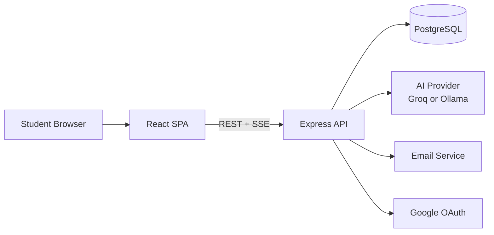
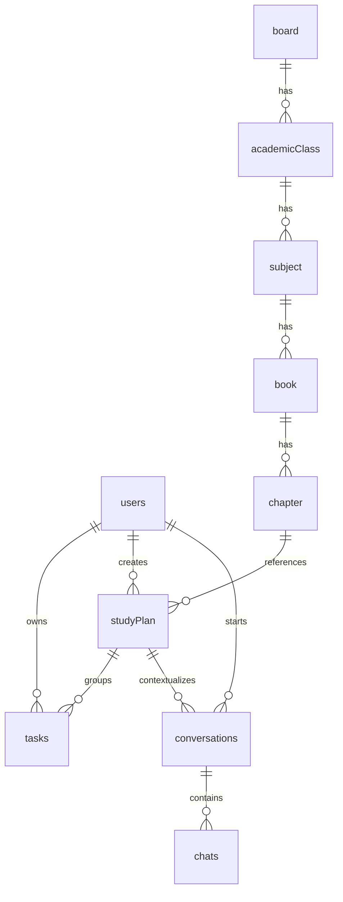

# StudyMuse Architecture

StudyMuse is a two-part web application: a Node.js and Express backend that exposes authenticated APIs, and a React single-page frontend built with Vite. The system is centered on student productivity, combining task management, study plans, progress analytics, and an AI study companion backed by streaming chat responses.

## System Summary

- Frontend: React 19, Vite, React Router, Axios, Tailwind CSS v4, shadcn/ui, Framer Motion.
- Backend: Node.js, Express 5, Prisma ORM, PostgreSQL, Zod validation, JWT auth, bcrypt, Google OAuth, email OTP flows.
- AI integration: Groq by default, with Ollama as an alternate provider through a shared provider interface.
- Persistence: PostgreSQL schema managed by Prisma migrations and seed scripts.
- Deployment shape: separate frontend and backend applications, with the frontend calling the backend over HTTP.

## High-Level Architecture

The frontend is responsible for routing, authenticated UI state, and chat streaming presentation. The backend owns authentication, business rules, data access, validation, and integration with external services.

## Repository Layout

The workspace is organized as a small monorepo with two app roots.

- Backend: API server, Prisma schema, migrations, seed scripts, controllers, services, middleware, routes, and providers.
- Frontend: Vite app, UI components, pages, hooks, context, and HTTP client configuration.
- Documents: architecture and project-level documentation.

## Backend Architecture

The backend entry point is `Backend/server.js`. It loads environment variables, sets up middleware, and mounts routers for the main domains:

- `/auth` for registration, login, profile, verification, password reset, OTP resend, and Google auth.
- `/dashboard` for student summary metrics.
- `/tasks` for CRUD task management.
- `/chat` for conversation history and streamed AI replies.
- `/studyPlan` for study plan CRUD.

### Request Pipeline

Requests pass through a consistent stack:

1. Environment loading and process configuration.
2. Security and logging middleware with Helmet, Morgan, and CORS.
3. JSON parsing.
4. Authentication middleware where required.
5. Zod validation middleware on selected routes.
6. Async controller wrappers and centralized error handling.

### Backend Layers

- Routes define endpoint shapes and attach validation/auth middleware.
- Controllers translate HTTP requests into service calls and responses.
- Services contain business logic and orchestrate data access and integrations.
- Query modules in `Backend/src/db` encapsulate Prisma database operations.
- Middleware handles auth, validation, logging, and errors.
- Providers abstract AI model selection.
- Utilities hold shared helpers for email, OTP, JWT, environment loading, and API responses.

### External Integrations

- Authentication: JWT tokens are issued on login and stored on the client.
- Google OAuth: sign-in is supported through Google identity verification.
- Email: OTP flows use a mailer utility for verification and password reset.
- AI: chat responses are streamed from the selected model provider.

## Frontend Architecture

The frontend is a React SPA initialized in `frontend/src/main.jsx`. It wraps the app in an auth provider and a Google OAuth provider, then renders the router tree.

### Client State and API Layer

- `AuthContext` stores the current token and user state.
- The Axios instance injects the bearer token from local storage into each API request.
- Custom hooks such as `useAuth`, `useChat`, and `useTasks` encapsulate feature-level data loading and mutations.

### Routing Model

`frontend/src/App.jsx` defines the visible application shell:

- Public routes: auth page, forgot password, reset password, and verify email.
- Protected routes: dashboard, tasks, chat, and profile.
- Protected layout: shared navbar and page shell for authenticated views.

### Frontend Responsibilities

- Present authentication and recovery flows.
- Fetch and mutate tasks and study data.
- Render AI conversations and stream assistant text as it arrives.
- Keep route access aligned with login state.
- Provide responsive UI with a reusable component library.

## Data Architecture

Prisma models define the app data model against PostgreSQL.

### Core Entities

- `users`: account profile, credentials, verification state, OTP state, and reset flags.
- `tasks`: user-owned actionable items linked to study plans.
- `studyPlan`: student study plans, optionally tied to a chapter.
- `conversations`: AI chat threads associated with a user and optionally a study plan.
- `chats`: individual chat messages stored under a conversation.
- `board`, `academicClass`, `subject`, `book`, `chapter`: curriculum hierarchy used for academic study planning.

### Relationships

- A user can own many tasks, study plans, and conversations.
- A study plan can be linked to a chapter and can own many tasks and conversations.
- A conversation owns many chat messages.
- The curriculum hierarchy is modeled top-down from board to chapter.

### Persistence Notes

- UUID primary keys are used across the schema.
- Prisma migrations are stored under `Backend/prisma/migrations`.
- Seed data is available for curriculum content.
- Timestamps and update tracking are handled at the model level.

## Authentication and Security

Security is implemented across transport, auth, validation, and data ownership.

- JWT-based auth protects private endpoints.
- Passwords are hashed with bcrypt.
- OTP flows support email verification and password reset.
- Protected routes use an auth middleware that resolves the current user.
- Zod schemas validate incoming payloads before controller execution.
- Helmet and CORS are configured in the server bootstrap.
- Rate limiting is applied to sensitive routes such as registration, login, OTP resend, and chat messaging.

## Main Request Flows

### Authentication Flow

1. The user submits credentials or Google sign-in.
2. The backend validates the request and authenticates the identity.
3. A JWT is returned and stored on the client.
4. The frontend adds the token to subsequent API calls.
5. Protected routes rely on the token to resolve the session.

### Task Flow

1. The tasks page loads the current user's tasks.
2. The client creates, updates, or deletes tasks through the API.
3. The backend validates ownership and persists changes through Prisma.
4. The client refreshes the task list after each mutation.

### Chat Flow

1. The user opens or creates a conversation.
2. The client posts a message to `/chat/:conv_id`.
3. The backend streams model output as server-sent events.
4. The client appends chunks to the assistant message in real time.
5. The backend stores the completed assistant reply after the stream finishes.

### Study Plan Flow

1. The user creates or edits a study plan.
2. The backend stores plan metadata and optional chapter linkage.
3. Tasks can be associated with the plan to connect execution with curriculum context.

## Operational Concerns

- The backend listens on the configured `PORT` and defaults to `3000`.
- CORS is currently limited to known frontend origins.
- The frontend expects `VITE_API_URL` and `VITE_GOOGLE_CLIENT_ID` environment variables.
- The AI provider is selected by `AI_PROVIDER`, defaulting to Groq when Ollama is not requested.
- Prisma manages schema evolution through migrations and seed scripts.

## Design Notes

- The codebase is organized by feature domain rather than by transport technology alone.
- Shared helpers are centralized so auth, validation, API response formatting, and token handling stay consistent.
- The chat feature is intentionally streaming-first rather than waiting for full completion before rendering.
- The frontend keeps session state lightweight and pushes authoritative checks to the backend.

## Suggested Next Additions

- API contract tables for each route group.
- Sequence diagrams for registration, password reset, and chat streaming.
- A deployment architecture section for Render, Netlify, PostgreSQL, and external AI/email services.
