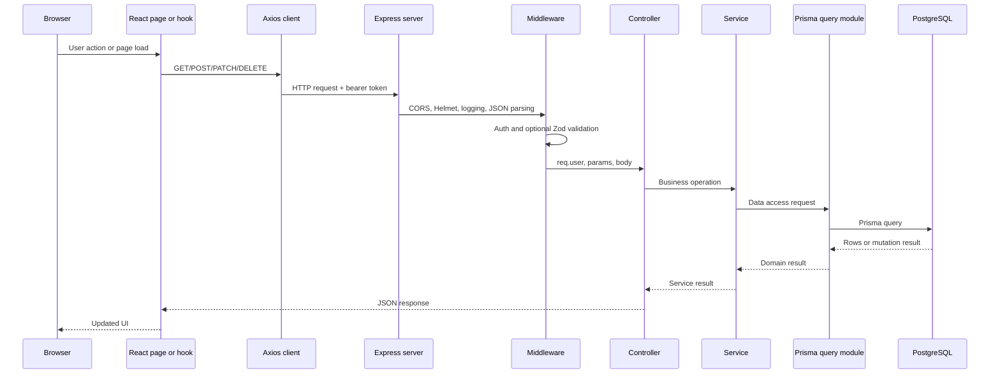
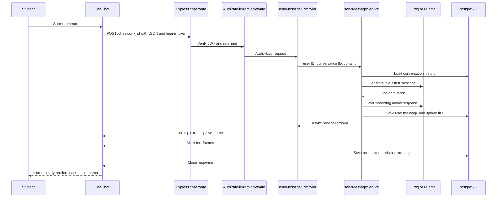

# StudyMuse: Interview Guide and Request/Response Flow

This guide is based on the current StudyMuse source code. It is intended for project walkthroughs, technical interviews, and onboarding.

## 1. Project Snapshot

StudyMuse is a student productivity application with:

- A React 19 and Vite single-page frontend.
- A Node.js and Express backend using ES modules.
- PostgreSQL persistence through Prisma.
- JWT authentication, bcrypt password hashing, OTP email flows, and Google authentication.
- Task, study-plan, dashboard, notes, academic-catalog, and AI chat features.
- Groq as the default AI provider and Ollama as an alternative provider.
- REST APIs for normal operations and Server-Sent Events (SSE) for streamed AI replies.

The main frontend entry point is `frontend/src/main.jsx`. The backend starts in `Backend/server.js`.

## 2. Thirty Interview Questions and Answers

### 1. What problem does StudyMuse solve?

**Answer:** StudyMuse brings study planning, task tracking, progress information, curriculum data, notes, and an AI study companion into one application. It is designed to help students organize what to study and what to do next.

### 2. What is the overall architecture?

**Answer:** It is a two-application architecture. A React/Vite frontend runs in the browser and calls an Express API over HTTP. The backend contains routes, middleware, controllers, services, database query modules, and AI providers. PostgreSQL is accessed through Prisma, while email, Google OAuth, and AI models are external integrations.

### 3. Why is the backend divided into routes, controllers, services, and query modules?

**Answer:** Each layer has a focused responsibility. Routes define HTTP endpoints and middleware; controllers translate HTTP input into application calls; services hold business rules and orchestration; query modules encapsulate Prisma operations. This keeps transport concerns separate from business and persistence concerns.

### 4. How does the backend start?

**Answer:** `Backend/server.js` loads environment configuration, creates an Express app, configures Helmet, Morgan, CORS, logging, and JSON parsing, mounts the feature routers, installs the error middleware, and listens on `PORT` or port `3000` on `0.0.0.0`.

### 5. Which route groups are mounted by the server?

**Answer:** The server mounts `/auth`, `/dashboard`, `/tasks`, `/chat`, `/studyPlan`, `/academic-catalog`, and `/study-plan` for notes. The last two names are different: study-plan CRUD uses `/studyPlan`, while the notes router is mounted at `/study-plan`.

### 6. How does a protected request authenticate?

**Answer:** The frontend stores the JWT in local storage. Axios adds `Authorization: bearer <token>` to normal API requests, and the chat `fetch()` call adds the same header manually. `authMiddleware` extracts the token, verifies it with `JWT_SECRET`, stores the decoded payload in `req.user`, and calls `next()`. Invalid or missing tokens result in a 401 error.

### 7. What is the role of the Axios instance?

**Answer:** `frontend/src/api/axios.js` centralizes the API base URL and JSON content type. Its request interceptor reads the token from local storage and injects the bearer header, so feature hooks do not need to repeat that setup for ordinary REST requests.

### 8. How is input validated?

**Answer:** Selected routes use the `validate(schema)` middleware. It calls the Zod schema's `safeParse` on `req.body`; invalid input is passed to the error pipeline as an `ApiError` with status 400. Valid input continues to the controller.

### 9. How are asynchronous controller errors handled?

**Answer:** Controllers are wrapped with `asyncWrap`, which allows rejected promises to reach Express error handling. The central `errorMiddleware` returns structured JSON for `ApiError` instances and a generic 500 response for unexpected errors.

### 10. How does registration and login work at a high level?

**Answer:** The client posts credentials to the auth routes. Validation and rate limiting run before the controller. The auth service verifies or creates the user, hashes passwords with bcrypt where appropriate, and issues a JWT. The frontend stores the token through `AuthContext`, which then enables protected routes and API calls.

### 11. What authentication features are supported besides password login?

**Answer:** The backend supports email verification OTPs, password-reset OTPs, password reset, OTP resend, profile operations, Google authentication, and account deletion. The user model stores verification and reset-related fields such as `isVerified`, `otp`, `otpExpiresAt`, `otpType`, and `canResetPassword`.

### 12. How does the React application protect pages?

**Answer:** `App.jsx` defines public routes and places dashboard, tasks, study plan, chat, and profile inside `ProtectedLayout`. That layout renders `ProtectedRoutes`, which decides whether an authenticated user may see the nested route. The layout also chooses desktop or mobile navigation based on the viewport.

### 13. What are the main persistent entities?

**Answer:** The Prisma schema includes users, tasks, study plans, conversations, chats, notes, note attachments, and an academic hierarchy of boards, classes, subjects, books, and chapters. UUIDs are used as primary keys, and relations define ownership and cascading deletes.

### 14. How are tasks related to study plans?

**Answer:** A task has a required `studyPlan_id` foreign key. A study plan has many tasks, and deleting a study plan cascades to its tasks. Task routes use the study-plan ID for listing and use ownership/business checks in the controller and service layer before mutations.

### 15. What is the purpose of the academic catalog?

**Answer:** The catalog represents curriculum structure: board, academic class, subject, book, and chapter. Academic study plans can reference a chapter, which gives a plan curriculum context rather than only a free-form title and description.

### 16. How does Prisma fit into the backend?

**Answer:** Prisma generates a typed database client from `schema.prisma`. Query modules use that client for reads, inserts, updates, deletes, filtering, ordering, and relations. Prisma migrations track schema changes, while seed scripts populate initial academic catalog data.

### 17. What is the difference between a controller and a service in this project?

**Answer:** A controller knows about `req`, `res`, route parameters, and HTTP response formatting. A service should be usable without HTTP knowledge and contains rules such as validating a chat prompt, loading message history, choosing a title, invoking an AI provider, and saving messages.

### 18. How does the dashboard get its data?

**Answer:** The dashboard route is mounted at `/dashboard` and is protected by authentication. Its controller calls the dashboard service, which gathers user-specific progress or summary information through the dashboard query module and returns it to the frontend in the standard API response shape.

### 19. How does the chat feature model conversations and messages?

**Answer:** A user owns many conversations, and each conversation owns many chat messages. A conversation can optionally be linked to a study plan. Messages have a `Role` enum of `user` or `assistant`, their text content, and a creation timestamp.

### 20. What happens when the first chat message is sent?

**Answer:** The chat service loads the conversation history. If it is empty, it asks the selected provider to generate a title, with `New Conversation` as a fallback if title generation fails. It then requests a response stream, saves the user message, updates the conversation title, and returns the stream to the controller.

### 21. Why does chat use SSE instead of waiting for one JSON response?

**Answer:** AI output is generated incrementally. SSE lets the backend send small text chunks as soon as they arrive, so the UI can show the answer being written and feel responsive. The connection stays open until the provider finishes or an error occurs.

### 22. How are AI providers switched?

**Answer:** `Backend/src/providers/index.js` selects Ollama when `AI_PROVIDER` is `ollama`; otherwise it selects Groq. Both providers expose functions such as `generateResponse` and `generateTitle`, allowing the chat service to use one shared provider interface.

### 23. What does the Groq provider do?

**Answer:** It creates a Groq client with `GROQ_API_KEY`, builds a system message plus recent history and the current user prompt, and calls `groq.chat.completions.create` with `stream: true`. It uses a separate non-streaming model call to generate a conversation title.

### 24. What does the Ollama provider currently do?

**Answer:** It calls `ollama.chat` with the configured local model and `stream: true` for responses. The current implementation sends only the new user message and does not include the `messageHistory` argument, so its context behavior differs from Groq and is an important implementation detail to mention in an interview.

### 25. How does the frontend consume a chat stream?

**Answer:** `useChat` sends a POST request with `fetch`, obtains a `ReadableStream` reader from `result.body`, decodes chunks with `TextDecoder`, buffers incomplete data, splits complete SSE events on blank lines, parses each `data:` payload as JSON, and appends its `text` field to the last assistant message in React state.

### 26. What does the backend save during a streamed chat response?

**Answer:** The user message is saved before the stream is consumed. The controller accumulates every assistant text chunk in `finishedResult`; after the provider stream finishes, it saves one complete assistant message. This avoids storing one database row per token or chunk.

### 27. What security controls are visible in the server?

**Answer:** Helmet adds security headers, CORS restricts known frontend origins, JWT protects private routes, Zod validates selected input, bcrypt protects passwords, and rate limiting is applied to sensitive authentication routes and chat messages. Database queries also scope many reads by the authenticated user ID.

### 28. What is a potential error-handling gap in the current SSE implementation?

**Answer:** The backend emits a named `event: error` followed by a data payload, but the frontend loop skips every event that does not start with `data: `. Therefore the frontend does not currently handle that named SSE error as a user-visible error; it should inspect event names or the backend should use a consistent data shape that the client handles.

### 29. What is a potential ownership concern in the chat implementation?

**Answer:** Reading messages uses `getMessages(user_id, conv_id)` and verifies that the conversation belongs to the user. However, `saveAssistantMessage` accepts only `conv_id`, `role`, and `content`, and `updateConversation` updates by conversation ID alone. A production hardening pass should carry the authenticated user ID through these operations and enforce ownership for every mutation.

### 30. What would you improve next in this project?

**Answer:** I would add focused backend and frontend tests for auth, ownership, validation, and SSE parsing; make SSE errors consistent; check `response.ok` before reading a stream; handle client disconnects with cancellation; include chat history in Ollama; add API contract documentation; and add observability around provider latency, stream failures, and token usage.

## 3. Request/Response Flow

### General REST flow



### Request pipeline in the actual server

1. `server.js` receives a request after the browser resolves `VITE_API_URL`.
2. CORS checks the request origin; Helmet, Morgan, and `logMethod` run as server middleware.
3. `express.json()` parses JSON request bodies.
4. The matching router selects an endpoint.
5. Route middleware runs in the order declared. Depending on the route, this includes rate limiting, Zod validation, and JWT authentication.
6. `asyncWrap` invokes the controller and forwards rejected promises.
7. The controller reads `req.user`, `req.params`, and `req.body`, then calls a service.
8. The service applies business rules and calls a query module or external provider.
9. Prisma talks to PostgreSQL for persistent data.
10. The controller returns a JSON response, usually through the shared `response` helper.
11. Failures reach `errorMiddleware`, which returns an error JSON response.

### Chat request and streaming response



### REST response shape

Successful feature controllers commonly use the shared `response` helper, producing a JSON envelope containing a success status, data, and message. Error middleware returns an envelope like:

```json
{
  "success": false,
  "message": "Unauthorized",
  "code": "..."
}
```

The exact `code` value depends on the `ApiError` instance.

## 4. Exact SSE Code From the Project

The following two blocks are copied from the current project code. The backend block is from `Backend/src/controllers/chat.controller.js`; the frontend block is from `frontend/src/hooks/useChat.js`.

### Backend: `sendMessageController`

```js
export async function sendMessageController(req, res) {
  const user_id = req.user.id;
  const conv_id = req.params.conv_id;
  const content = req.body.content;
  const stream = await sendMessageService(user_id, conv_id, content);

  res.setHeader("Content-Type", "text/event-stream");
  res.setHeader("Cache-Control", "no-cache");
  res.setHeader("Connection", "keep-alive");
  if (res.flush) res.flush();

  let finishedResult = "";

  try {
    for await (const chunk of stream) {
      let text = ""
      if (process.env.AI_PROVIDER === "ollama") {
        text = chunk.message?.content || "";
      }else{
      text = chunk.choices?.[0]?.delta?.content || "";
      }
      if (text) {
        res.write(`data: ${JSON.stringify({ text })}\n\n`);
        console.log("TEXT:", text);
        finishedResult += text;
      }
    }
    await saveAssistantMessage(conv_id, "assistant", finishedResult);
  } catch (err) {
    console.error("========== STREAM ERROR ==========");
    console.error("Message:", err.message);

    res.write(`event: error\n`);
    res.write(
      `data: ${JSON.stringify({
        message: "Response was interrupted. Please try again.",
      })}\n\n`,
    );
  } finally {
    res.end();
  }
}
```

> Note: The repository's controller currently declares `next` as a third parameter. It is unused, so it is omitted in the readable copy above only to match the function's behavior; the exact source signature is `sendMessageController(req, res, next)`.

### Frontend: stream-reading section of `sendMessage`

```js
const result = await fetch(
  `${import.meta.env.VITE_API_URL}/chat/${conv_id}`,
  {
    method: "POST",
    headers: {
      "Content-type": "application/json",
      Accept: "text/event-stream",
      Authorization: `bearer ${localStorage.getItem("token")}`,
    },
    body: JSON.stringify({ content }),
  },
);
const reader = result.body.getReader();
const decoder = new TextDecoder();

let buffer = "";

while (true) {
  const { done, value } = await reader.read();
  if (done) break;

  buffer += decoder.decode(value, { stream: true });

  const events = buffer.split("\n\n");
  buffer = events.pop() || "";

  for (const event of events) {
    if (!event.startsWith("data: ")) continue;

    try {
      const data = JSON.parse(event.slice(6));
      if (data.error) {
        console.error(data.message);
        return;
      }

      const { text } = data;

      setMessages((prev) => {
        const updated = [...prev];
        const lastMessage = updated[updated.length - 1];

        updated[updated.length - 1] = {
          ...lastMessage,
          content: lastMessage.content + text,
        };

        return updated;
      });
    } catch (err) {
      console.error("Invalid SSE event:", event);
    }
  }
}
```

## 5. SSE Explained Simply

SSE is a long-lived HTTP response. Instead of returning one JSON object and closing immediately, the server keeps the response open and writes small, newline-delimited events.

### What the server sends

For each AI text chunk, the backend sends a frame shaped like this:

```text
data: {"text":"Hello"}

```

The blank line after the data is important: it marks the end of one SSE event. The server repeats this as the AI generates more text.

### What the browser does

1. `fetch()` starts the POST request.
2. `result.body.getReader()` reads raw network chunks.
3. A `TextDecoder` converts bytes into text.
4. A `buffer` preserves a partial event when the network splits it in the middle.
5. `split("\n\n")` extracts complete SSE events and keeps the unfinished remainder in `buffer`.
6. `event.slice(6)` removes the `data: ` prefix.
7. `JSON.parse` turns the payload into `{ text }`.
8. React appends that text to the last assistant message, creating the typewriter effect.

### Why buffering is necessary

Network chunks are not guaranteed to match application messages. One read may contain half of a JSON payload, or several events at once. Keeping the incomplete tail in `buffer` prevents the client from trying to parse incomplete JSON.

### Important current behavior

- The response is manually consumed with `fetch()` rather than the browser `EventSource` API because this is a POST request with a JSON body and an Authorization header.
- The backend sends `event: error` on failure, but the frontend only accepts events beginning with `data: `. The named error event is therefore skipped by the current parser.
- The frontend does not check `result.ok` or `result.body` before calling `getReader()`. A non-stream JSON error response can therefore produce a client-side failure instead of a clean displayed error.
- The controller closes the response with `res.end()` in `finally`, both after success and after a stream error.
- The complete assistant response is saved only after the provider stream finishes. An interrupted stream is not saved as an assistant message by this controller.

## 6. Useful Source Map

| Area | Main files |
|---|---|
| Server bootstrap | `Backend/server.js` |
| Authentication routes and controllers | `Backend/src/routes/auth.routes.js`, `Backend/src/controllers/auth.controller.js` |
| Auth middleware | `Backend/src/middleware/auth.middleware.js` |
| Chat route | `Backend/src/routes/chat.routes.js` |
| Chat HTTP controller | `Backend/src/controllers/chat.controller.js` |
| Chat business logic | `Backend/src/services/chat.service.js` |
| Chat persistence | `Backend/src/db/chat.query.js` |
| AI provider selection | `Backend/src/providers/index.js` |
| Groq integration | `Backend/src/providers/groq.provider.js` |
| Ollama integration | `Backend/src/providers/ollama.provider.js` |
| Database model | `Backend/prisma/schema.prisma` |
| Frontend entry point | `frontend/src/main.jsx` |
| Frontend routes | `frontend/src/App.jsx` |
| Auth state | `frontend/src/context/AuthContext.jsx` |
| Normal HTTP client | `frontend/src/api/axios.js` |
| Chat client and SSE parser | `frontend/src/hooks/useChat.js` |
